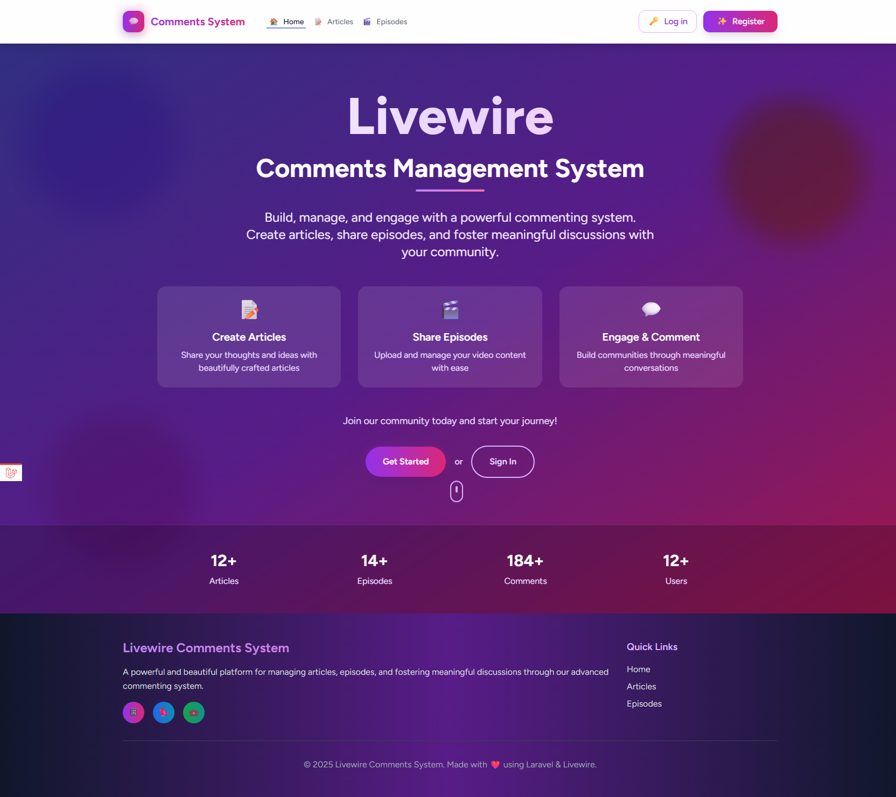
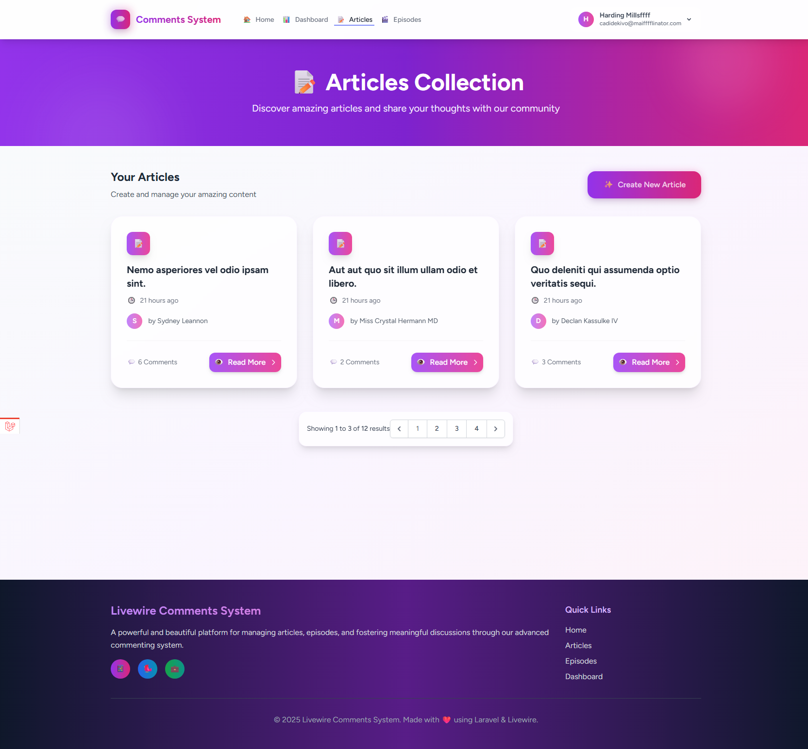
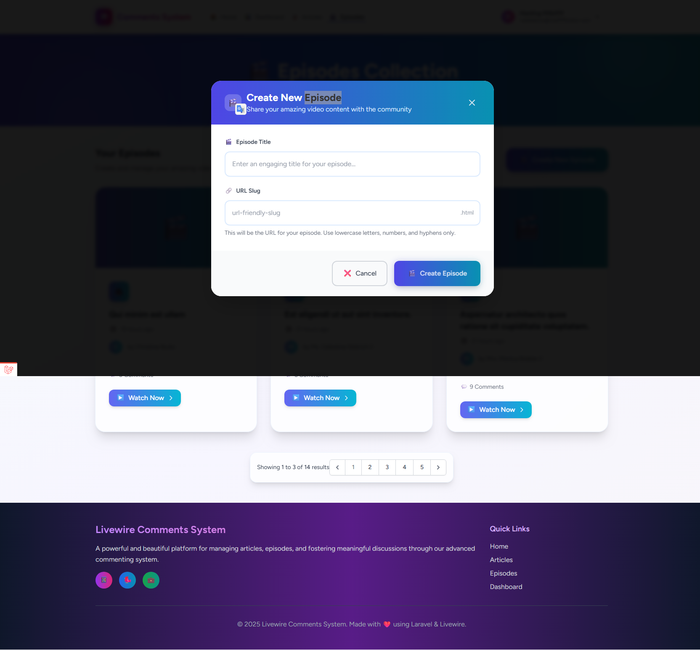
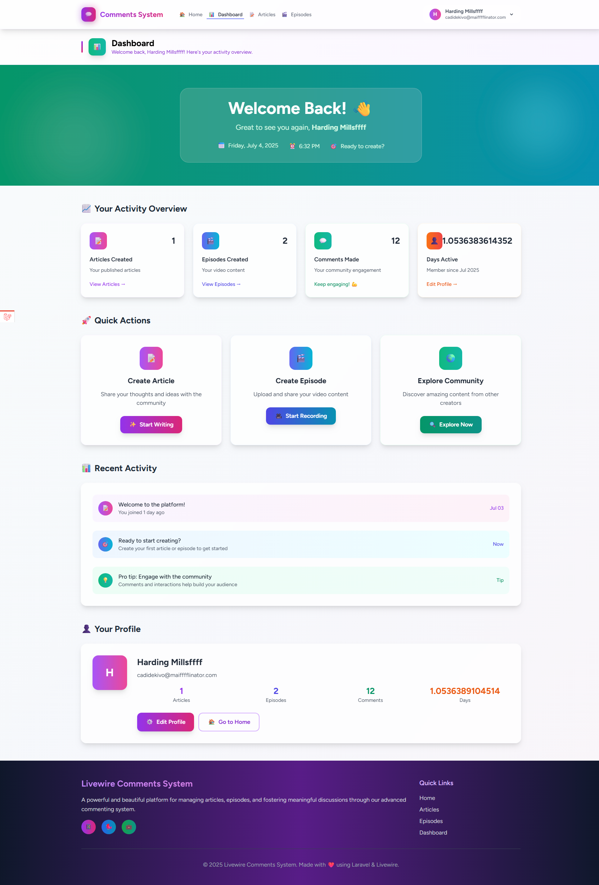

# Comments System with Laravel Livewire

A modern, interactive comments system built with Laravel 11 and Livewire 3. This application demonstrates real-time commenting functionality with nested replies, user authentication, and a clean, responsive interface.

## Features

### 🚀 Core Functionality
- **Real-time Comments**: Post and view comments without page reloads
- **Nested Replies**: Multi-level comment threading system
- **User Authentication**: Secure login and registration system
- **Comment Management**: Edit, delete, and manage your comments
- **Pagination**: Efficient loading of large comment threads

### 🎨 User Interface
- **Responsive Design**: Works seamlessly on desktop and mobile devices
- **Modern UI**: Clean and intuitive interface with Tailwind CSS
- **Interactive Elements**: Smooth animations and transitions
- **User Profiles**: Customizable user profile settings

### 🔧 Technical Features
- **Laravel 11**: Latest Laravel framework with modern PHP features
- **Livewire 3**: Reactive components for dynamic user interactions
- **MySQL Database**: Robust data storage and relationships
- **Factory & Seeders**: Easy database population for testing
- **Policy-based Authorization**: Secure access control system

## Screenshots

### 🏠 Home Page


### 📝 Articles Management


### 📖 Article Details with Comments


### 🎬 Episodes Section


### 📺 Episode Details


### 📊 Dashboard


### 👤 User Authentication


### ⚙️ Profile Settings


## Requirements

- **PHP**: 8.2 or higher
- **Laravel**: 11.x
- **Livewire**: 3.x
- **Database**: MySQL 5.7+ or PostgreSQL 13+
- **Node.js**: 18+ (for asset compilation)
- **Composer**: 2.x

## Installation

### 📥 Clone the Repository
```bash
git clone https://github.com/yourusername/comments-system-with-laravel-livewire.git
cd comments-system-with-laravel-livewire
```

### 📦 Install Dependencies
```bash
# Install PHP dependencies
composer install

# Install Node.js dependencies
npm install
```

### ⚙️ Environment Configuration
```bash
# Copy environment file
cp .env.example .env

# Generate application key
php artisan key:generate
```

### 🗄️ Database Setup
1. Configure your database settings in `.env`:
```env
DB_CONNECTION=mysql
DB_HOST=127.0.0.1
DB_PORT=3306
DB_DATABASE=comments_system
DB_USERNAME=your_username
DB_PASSWORD=your_password
```

2. Run migrations and seeders:
```bash
# Run database migrations
php artisan migrate

# (Optional) Seed the database with sample data
php artisan db:seed
```

### 🎨 Asset Compilation
```bash
# For development
npm run dev

# For production
npm run build

# For development with file watching
npm run dev -- --watch
```

### 🚀 Start the Application
```bash
php artisan serve
```

The application will be available at `http://localhost:8000`

## Usage

### 👤 Getting Started
1. **Register an Account**: Create a new user account or log in with existing credentials
2. **Explore Content**: Browse articles and episodes on the platform
3. **Engage with Comments**: 
   - Post new comments on articles and episodes
   - Reply to existing comments to create threaded discussions
   - Edit or delete your own comments
4. **Real-time Updates**: See new comments and replies appear instantly without page refreshes

### 🎯 Key Features in Action
- **Articles**: Browse and comment on blog posts and articles
- **Episodes**: Engage with video/podcast episode discussions  
- **User Dashboard**: Manage your profile and view your activity
- **Profile Settings**: Customize your account preferences

### 💡 Tips
- Comments support nested replies for organized discussions
- Use the pagination controls to navigate through large comment threads
- Your comments are automatically saved and appear in real-time for other users

## 🏗️ Project Structure

```
app/
├── Http/Controllers/     # HTTP controllers
├── Livewire/            # Livewire components
│   ├── Articles.php     # Article listing component
│   ├── Comment.php      # Individual comment component
│   ├── Comments.php     # Comments section component
│   └── Episodes.php     # Episode listing component
├── Models/              # Eloquent models
│   ├── Article.php      # Article model
│   ├── Comment.php      # Comment model with nested relationships
│   ├── Episode.php      # Episode model
│   └── User.php         # User model
└── Policies/            # Authorization policies
    ├── ArticlePolicy.php
    ├── CommentPolicy.php
    └── EpisodePolicy.php
```

## 🧪 Testing

```bash
# Run all tests
php artisan test

# Run specific test suite
php artisan test --filter=CommentTest

# Run tests with coverage
php artisan test --coverage
```

## 🤝 Contributing

We welcome contributions to improve this comments system! Here's how you can help:

### 🔧 Development Setup
1. Fork the repository
2. Create a feature branch: `git checkout -b feature/amazing-feature`
3. Make your changes and test thoroughly
4. Commit your changes: `git commit -m 'Add amazing feature'`
5. Push to the branch: `git push origin feature/amazing-feature`
6. Open a Pull Request

### 📋 Contribution Guidelines
- Follow PSR-12 coding standards
- Write tests for new features
- Update documentation as needed
- Ensure all tests pass before submitting

### 🐛 Bug Reports
Please use the GitHub issue tracker to report bugs. Include:
- Steps to reproduce the issue
- Expected vs actual behavior
- Screenshots if applicable
- Environment details (PHP version, Laravel version, etc.)

## 📄 License

This project is open-sourced software licensed under the [MIT license](https://opensource.org/licenses/MIT).

## 🙏 Acknowledgments

- [Laravel](https://laravel.com/) - The PHP framework for web artisans
- [Livewire](https://livewire.laravel.com/) - A full-stack framework for Laravel
- [Tailwind CSS](https://tailwindcss.com/) - A utility-first CSS framework
- [MySQL](https://www.mysql.com/) - The world's most popular open source database

## 📞 Support

If you encounter any issues or have questions:
- 📧 Open an issue on GitHub
- 💬 Join our community discussions
- 📖 Check the documentation

---

⭐ If you found this project helpful, please consider giving it a star on GitHub!
